# Learnova

## Admin Diagrams

### Flowchart

```mermaid
flowchart TD
    A[Admin Login] --> B[Dashboard]
    B --> C[Academic Management]
    B --> D[User Management]
    B --> E[Curriculum Management]
    B --> F[Scheduling]
    B --> G[System Configuration]
    
    C --> C1[Create Academic Year]
    C --> C2[Add Semesters]
    C --> C3[Manage Grades]
    C --> C4[Create Classes]
    
    D --> D1[Add Teachers]
    D --> D2[Add Students]
    D --> D3[Add Parents]
    D --> D4[Add Admins]
    D --> D5[Bulk Student Import]
    D --> D6[Assign Students to Classes]
    
    E --> E1[Create Subjects]
    E --> E2[Assign Subjects to Grades]
    E --> E3[Manage Curriculum Structure]
    
    F --> F1[Create Class Schedules]
    F --> F2[Assign Teachers to Classes]
    F --> F3[Manage Timetables]
    F --> F4[Check Schedule Conflicts]
    
    G --> G1[Update Profile]
    G --> G2[Configure System Settings]
    G --> G3[Backup & Restore]
    G --> G4[Manage Academic Calendar]
```

### Sequence Diagram: Student Creation
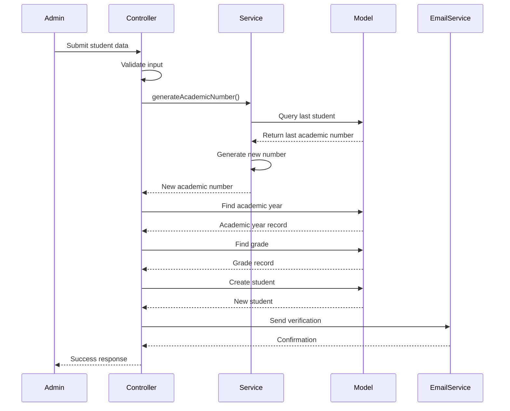
```mermaid
sequenceDiagram
    participant Admin
    participant Controller
    participant Service
    participant Model
    participant EmailService
    
    Admin->>Controller: Submit student data
    Controller->>Controller: Validate input
    Controller->>Service: generateAcademicNumber()
    Service->>Model: Query last student
    Model-->>Service: Return last academic number
    Service->>Service: Generate new number
    Service-->>Controller: New academic number
    Controller->>Model: Find academic year
    Model-->>Controller: Academic year record
    Controller->>Model: Find grade
    Model-->>Controller: Grade record
    Controller->>Model: Create student
    Model-->>Controller: New student
    Controller->>EmailService: Send verification
    EmailService-->>Controller: Confirmation
    Controller-->>Admin: Success response
```

### Sequence Diagram: Admin Creating a Class Schedule
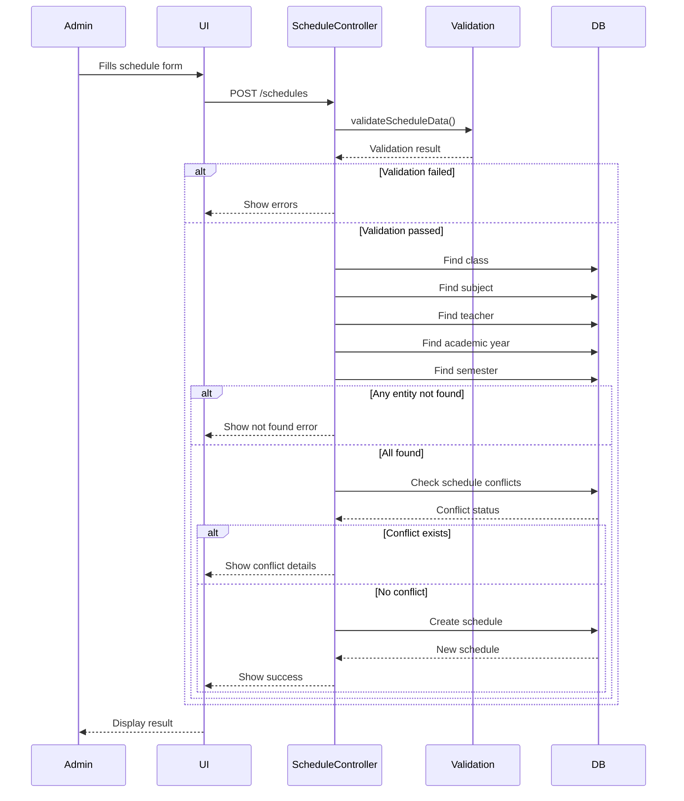
```mermaid
sequenceDiagram
    participant Admin
    participant UI
    participant ScheduleController
    participant Validation
    participant DB
    
    Admin->>UI: Fills schedule form
    UI->>ScheduleController: POST /schedules
    ScheduleController->>Validation: validateScheduleData()
    Validation-->>ScheduleController: Validation result
    
    alt Validation failed
        ScheduleController-->>UI: Show errors
    else Validation passed
        ScheduleController->>DB: Find class
        ScheduleController->>DB: Find subject
        ScheduleController->>DB: Find teacher
        ScheduleController->>DB: Find academic year
        ScheduleController->>DB: Find semester
        
        alt Any entity not found
            ScheduleController-->>UI: Show not found error
        else All found
            ScheduleController->>DB: Check schedule conflicts
            DB-->>ScheduleController: Conflict status
            
            alt Conflict exists
                ScheduleController-->>UI: Show conflict details
            else No conflict
                ScheduleController->>DB: Create schedule
                DB-->>ScheduleController: New schedule
                ScheduleController-->>UI: Show success
            end
        end
    end
    UI-->>Admin: Display result
```
### Sequence Diagram: Admin Assigning Teacher to Class
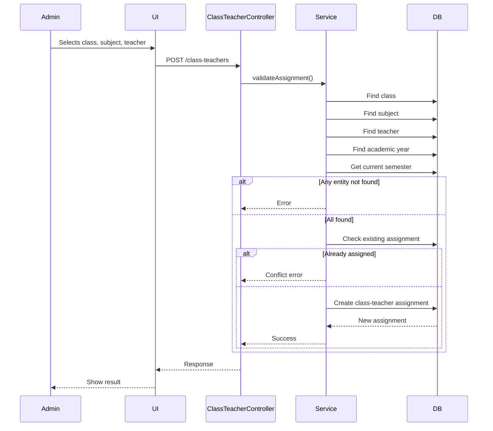
```mermaid
sequenceDiagram
    participant Admin
    participant UI
    participant ClassTeacherController
    participant Service
    participant DB
    
    Admin->>UI: Selects class, subject, teacher
    UI->>ClassTeacherController: POST /class-teachers
    ClassTeacherController->>Service: validateAssignment()
    
    Service->>DB: Find class
    Service->>DB: Find subject
    Service->>DB: Find teacher
    Service->>DB: Find academic year
    Service->>DB: Get current semester
    
    alt Any entity not found
        Service-->>ClassTeacherController: Error
    else All found
        Service->>DB: Check existing assignment
        alt Already assigned
            Service-->>ClassTeacherController: Conflict error
        else
            Service->>DB: Create class-teacher assignment
            DB-->>Service: New assignment
            Service-->>ClassTeacherController: Success
        end
    end
    
    ClassTeacherController-->>UI: Response
    UI-->>Admin: Show result
```
### Sequence Diagram: Admin Creating Curriculum Structure (Grade-Subject-Semester)
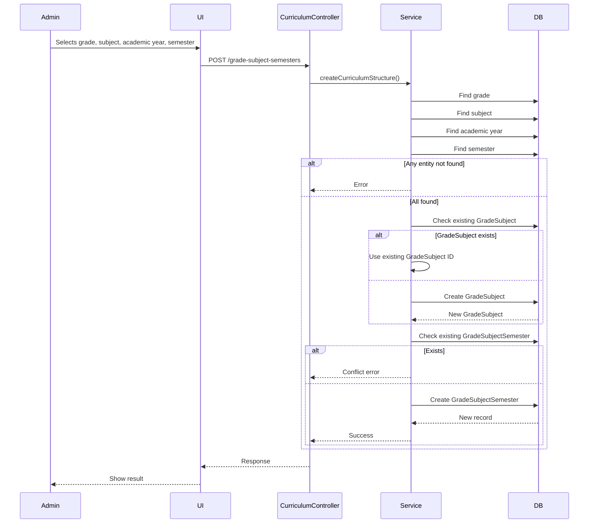
```mermaid
sequenceDiagram
    participant Admin
    participant UI
    participant CurriculumController
    participant Service
    participant DB
    
    Admin->>UI: Selects grade, subject, academic year, semester
    UI->>CurriculumController: POST /grade-subject-semesters
    CurriculumController->>Service: createCurriculumStructure()
    
    Service->>DB: Find grade
    Service->>DB: Find subject
    Service->>DB: Find academic year
    Service->>DB: Find semester
    
    alt Any entity not found
        Service-->>CurriculumController: Error
    else All found
        Service->>DB: Check existing GradeSubject
        alt GradeSubject exists
            Service->>Service: Use existing GradeSubject ID
        else 
            Service->>DB: Create GradeSubject
            DB-->>Service: New GradeSubject
        end
        
        Service->>DB: Check existing GradeSubjectSemester
        alt Exists
            Service-->>CurriculumController: Conflict error
        else
            Service->>DB: Create GradeSubjectSemester
            DB-->>Service: New record
            Service-->>CurriculumController: Success
        end
    end
    
    CurriculumController-->>UI: Response
    UI-->>Admin: Show result
```
### Sequence Diagram: Admin Bulk Student Import
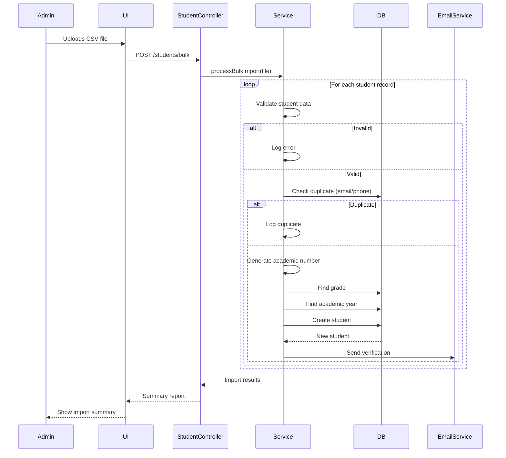
```mermaid
sequenceDiagram
    participant Admin
    participant UI
    participant StudentController
    participant Service
    participant DB
    participant EmailService
    
    Admin->>UI: Uploads CSV file
    UI->>StudentController: POST /students/bulk
    StudentController->>Service: processBulkImport(file)
    
    loop For each student record
        Service->>Service: Validate student data
        alt Invalid
            Service->>Service: Log error
        else Valid
            Service->>DB: Check duplicate (email/phone)
            alt Duplicate
                Service->>Service: Log duplicate
            else
                Service->>Service: Generate academic number
                Service->>DB: Find grade
                Service->>DB: Find academic year
                Service->>DB: Create student
                DB-->>Service: New student
                Service->>EmailService: Send verification
            end
        end
    end
    
    Service-->>StudentController: Import results
    StudentController-->>UI: Summary report
    UI-->>Admin: Show import summary
```
### Sequence Diagram: Class Schedule Creation Sequence

```mermaid
sequenceDiagram
    participant Admin
    participant UI
    participant ScheduleController
    participant Validation
    participant DB
    
    Admin->>UI: Fills schedule form
    UI->>ScheduleController: POST /schedules
    ScheduleController->>Validation: validateScheduleData()
    Validation-->>ScheduleController: Validation result
    
    alt Validation failed
        ScheduleController-->>UI: Show errors
    else Validation passed
        ScheduleController->>DB: Find class
        ScheduleController->>DB: Find subject
        ScheduleController->>DB: Find teacher
        ScheduleController->>DB: Find academic year
        ScheduleController->>DB: Find semester
        
        alt Any entity not found
            ScheduleController-->>UI: Show not found error
        else All found
            ScheduleController->>DB: Check schedule conflicts
            DB-->>ScheduleController: Conflict status
            
            alt Conflict exists
                ScheduleController-->>UI: Show conflict details
            else No conflict
                ScheduleController->>DB: Create schedule
                DB-->>ScheduleController: New schedule
                ScheduleController-->>UI: Show success
            end
        end
    end
    UI-->>Admin: Display result
```
### Sequence Diagram: Admin Profile Update
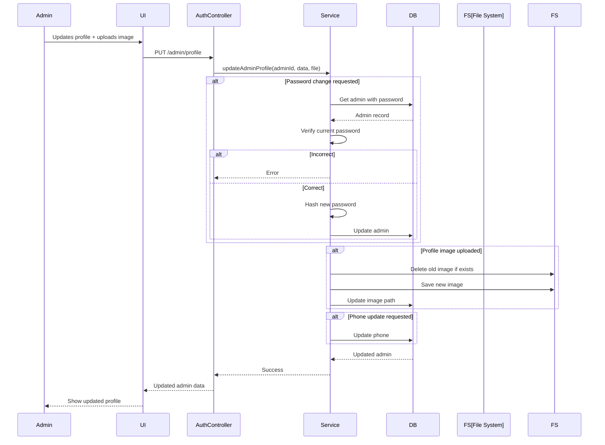
```mermaid
sequenceDiagram
    participant Admin
    participant UI
    participant AuthController
    participant Service
    participant DB
    participant FS[File System]
    
    Admin->>UI: Updates profile + uploads image
    UI->>AuthController: PUT /admin/profile
    AuthController->>Service: updateAdminProfile(adminId, data, file)
    
    alt Password change requested
        Service->>DB: Get admin with password
        DB-->>Service: Admin record
        Service->>Service: Verify current password
        alt Incorrect
            Service-->>AuthController: Error
        else Correct
            Service->>Service: Hash new password
            Service->>DB: Update admin
        end
    end
    
    alt Profile image uploaded
        Service->>FS: Delete old image if exists
        Service->>FS: Save new image
        Service->>DB: Update image path
    end
    
    alt Phone update requested
        Service->>DB: Update phone
    end
    
    DB-->>Service: Updated admin
    Service-->>AuthController: Success
    AuthController-->>UI: Updated admin data
    UI-->>Admin: Show updated profile
```
### Entity State Diagram: Academic Year Lifecycle
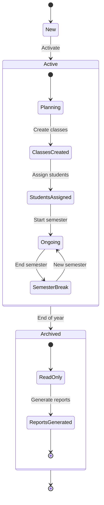
```mermaid
stateDiagram-v2
    [*] --> New
    New --> Active: Activate
    Active --> Archived: End of year
    Archived --> [*]
    
    state Active {
        [*] --> Planning
        Planning --> ClassesCreated: Create classes
        ClassesCreated --> StudentsAssigned: Assign students
        StudentsAssigned --> Ongoing: Start semester
        Ongoing --> SemesterBreak: End semester
        SemesterBreak --> Ongoing: New semester
    }
    
    state Archived {
        [*] --> ReadOnly
        ReadOnly --> ReportsGenerated: Generate reports
        ReportsGenerated --> [*]
    }
```
### Class Diagram: Core Admin Functionality
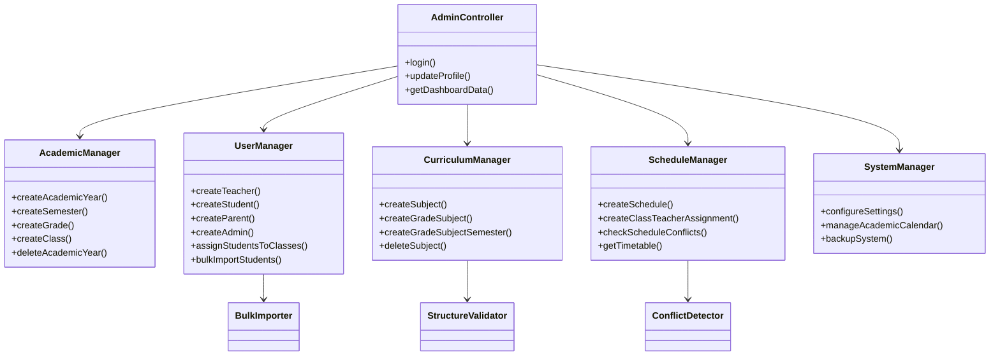
```mermaid
classDiagram
    class AdminController {
        +login()
        +updateProfile()
        +getDashboardData()
    }
    
    class AcademicManager {
        +createAcademicYear()
        +createSemester()
        +createGrade()
        +createClass()
        +deleteAcademicYear()
    }
    
    class UserManager {
        +createTeacher()
        +createStudent()
        +createParent()
        +createAdmin()
        +assignStudentsToClasses()
        +bulkImportStudents()
    }
    
    class CurriculumManager {
        +createSubject()
        +createGradeSubject()
        +createGradeSubjectSemester()
        +deleteSubject()
    }
    
    class ScheduleManager {
        +createSchedule()
        +createClassTeacherAssignment()
        +checkScheduleConflicts()
        +getTimetable()
    }
    
    class SystemManager {
        +configureSettings()
        +manageAcademicCalendar()
        +backupSystem()
    }
    
    AdminController --> AcademicManager
    AdminController --> UserManager
    AdminController --> CurriculumManager
    AdminController --> ScheduleManager
    AdminController --> SystemManager
    
    ScheduleManager --> ConflictDetector
    UserManager --> BulkImporter
    CurriculumManager --> StructureValidator
```

## Teacher Diagrams

### Class Diagram
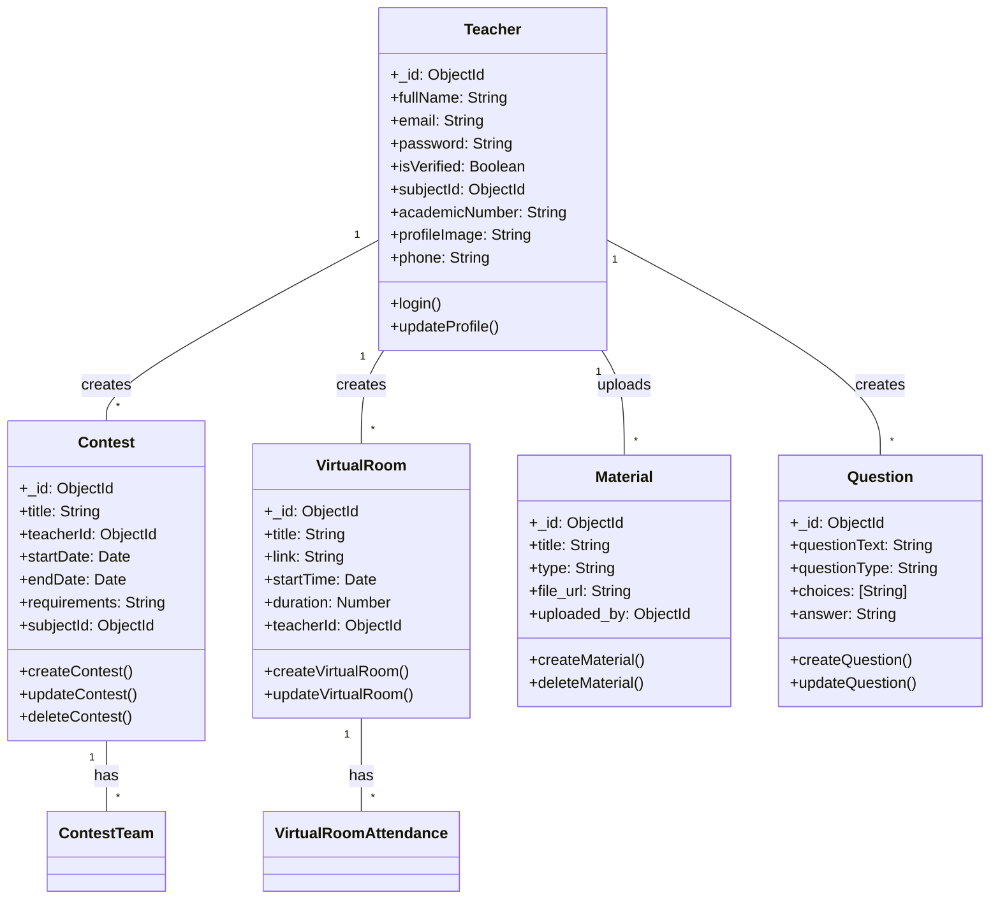
```mermaid
classDiagram
    class Teacher {
        +_id: ObjectId
        +fullName: String
        +email: String
        +password: String
        +isVerified: Boolean
        +subjectId: ObjectId
        +academicNumber: String
        +profileImage: String
        +phone: String
        +login()
        +updateProfile()
    }
    
    class Contest {
        +_id: ObjectId
        +title: String
        +teacherId: ObjectId
        +startDate: Date
        +endDate: Date
        +requirements: String
        +subjectId: ObjectId
        +createContest()
        +updateContest()
        +deleteContest()
    }
    
    class VirtualRoom {
        +_id: ObjectId
        +title: String
        +link: String
        +startTime: Date
        +duration: Number
        +teacherId: ObjectId
        +createVirtualRoom()
        +updateVirtualRoom()
    }
    
    class Material {
        +_id: ObjectId
        +title: String
        +type: String
        +file_url: String
        +uploaded_by: ObjectId
        +createMaterial()
        +deleteMaterial()
    }
    
    class Question {
        +_id: ObjectId
        +questionText: String
        +questionType: String
        +choices: [String]
        +answer: String
        +createQuestion()
        +updateQuestion()
    }
    
    Teacher "1" -- "*" Contest : creates
    Teacher "1" -- "*" VirtualRoom : creates
    Teacher "1" -- "*" Material : uploads
    Teacher "1" -- "*" Question : creates
    Contest "1" -- "*" ContestTeam : has
    VirtualRoom "1" -- "*" VirtualRoomAttendance : has
```
### Sequence Diagram: Teacher Login
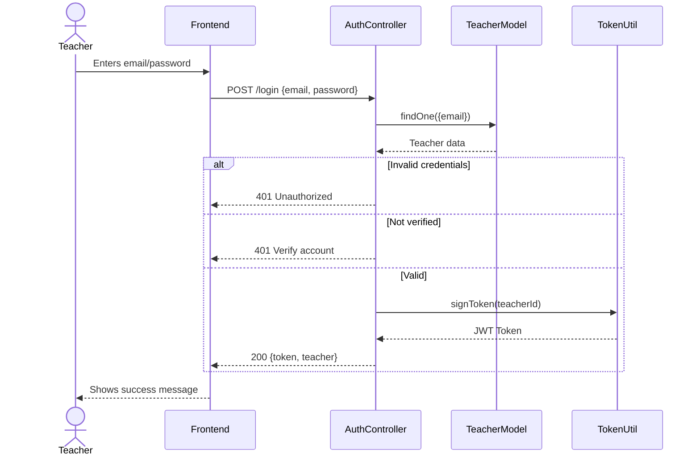
```mermaid
sequenceDiagram
    actor Teacher
    participant UI as Frontend
    participant AuthController
    participant TeacherModel
    participant TokenUtil
    
    Teacher->>UI: Enters email/password
    UI->>AuthController: POST /login {email, password}
    AuthController->>TeacherModel: findOne({email})
    TeacherModel-->>AuthController: Teacher data
    alt Invalid credentials
        AuthController-->>UI: 401 Unauthorized
    else Not verified
        AuthController-->>UI: 401 Verify account
    else Valid
        AuthController->>TokenUtil: signToken(teacherId)
        TokenUtil-->>AuthController: JWT Token
        AuthController-->>UI: 200 {token, teacher}
    end
    UI-->>Teacher: Shows success message
```
### Sequence Diagram: Virtual Room Creation Sequence
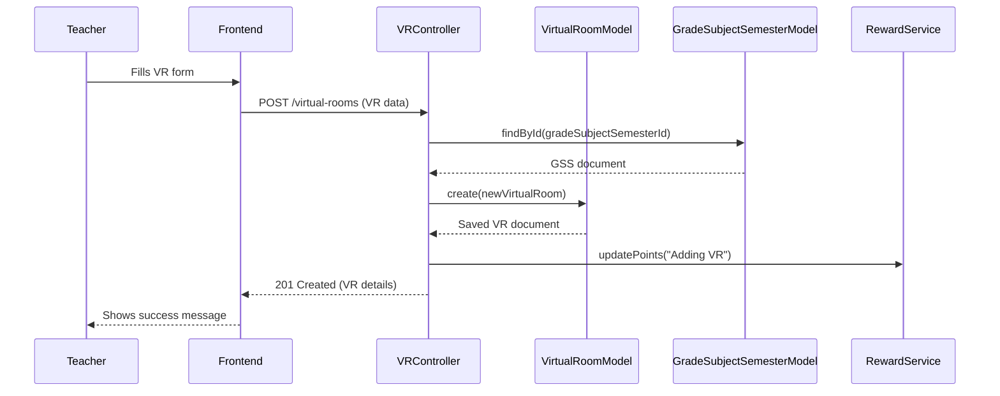
```mermaid
sequenceDiagram
    participant Teacher
    participant UI as Frontend
    participant VRController
    participant VirtualRoomModel
    participant GradeSubjectSemesterModel
    
    Teacher->>UI: Fills VR form
    UI->>VRController: POST /virtual-rooms (VR data)
    VRController->>GradeSubjectSemesterModel: findById(gradeSubjectSemesterId)
    GradeSubjectSemesterModel-->>VRController: GSS document
    VRController->>VirtualRoomModel: create(newVirtualRoom)
    VirtualRoomModel-->>VRController: Saved VR document
    VRController->>RewardService: updatePoints("Adding VR")
    VRController-->>UI: 201 Created (VR details)
    UI-->>Teacher: Shows success message
```
### Sequence Diagram: Exam Score Upload Sequence
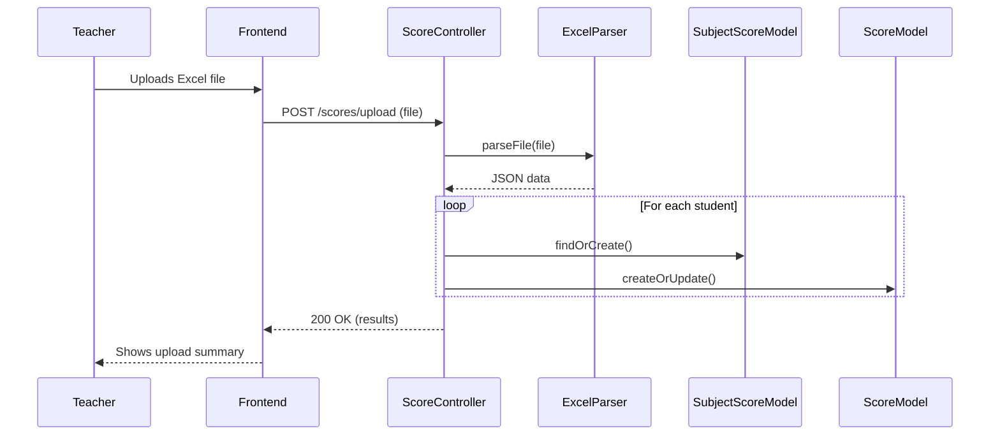
```mermaid
sequenceDiagram
    participant Teacher
    participant UI as Frontend
    participant ScoreController
    participant ExcelParser
    participant SubjectScoreModel
    participant ScoreModel
    
    Teacher->>UI: Uploads Excel file
    UI->>ScoreController: POST /scores/upload (file)
    ScoreController->>ExcelParser: parseFile(file)
    ExcelParser-->>ScoreController: JSON data
    loop For each student
        ScoreController->>SubjectScoreModel: findOrCreate()
        ScoreController->>ScoreModel: createOrUpdate()
    end
    ScoreController-->>UI: 200 OK (results)
    UI-->>Teacher: Shows upload summary
```
### Sequence Diagram: Material Creation Sequence
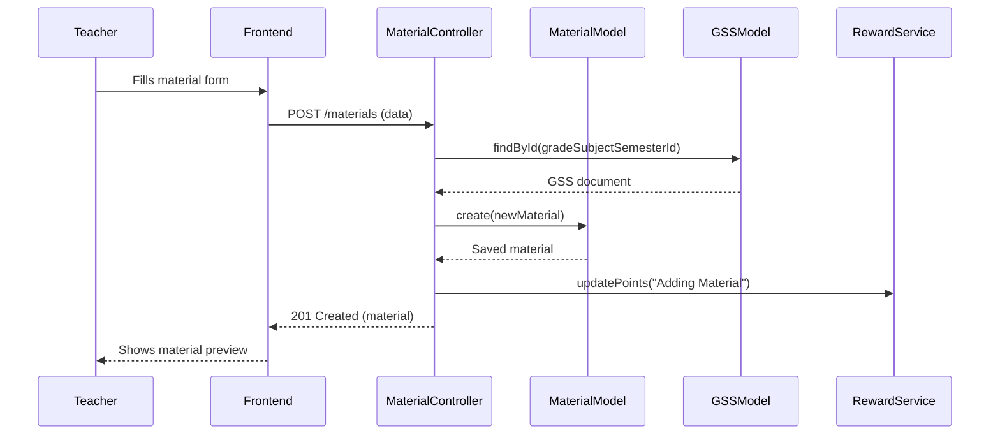
```mermaid
sequenceDiagram
    participant Teacher
    participant UI as Frontend
    participant MaterialController
    participant MaterialModel
    participant GSSModel
    
    Teacher->>UI: Fills material form
    UI->>MaterialController: POST /materials (data)
    MaterialController->>GSSModel: findById(gradeSubjectSemesterId)
    GSSModel-->>MaterialController: GSS document
    MaterialController->>MaterialModel: create(newMaterial)
    MaterialModel-->>MaterialController: Saved material
    MaterialController->>RewardService: updatePoints("Adding Material")
    MaterialController-->>UI: 201 Created (material)
    UI-->>Teacher: Shows material preview
```
### Sequence Diagram: Question Bank Management Sequence
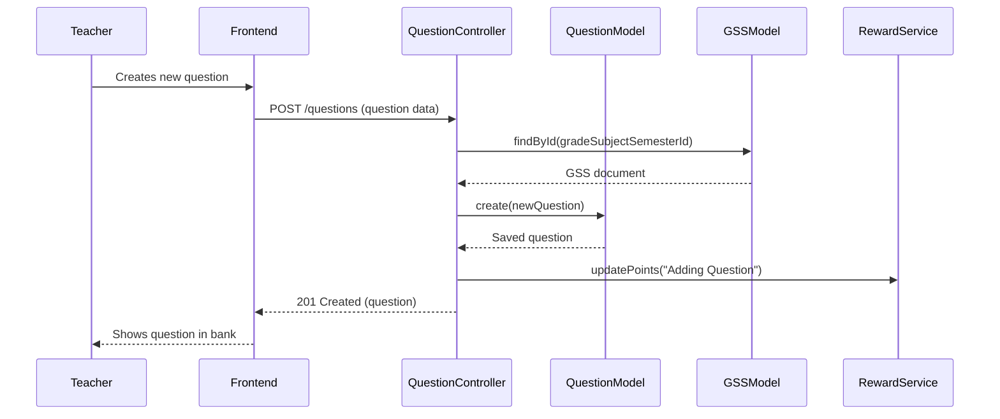
```mermaid
sequenceDiagram
    participant Teacher
    participant UI as Frontend
    participant QuestionController
    participant QuestionModel
    participant GSSModel
    
    Teacher->>UI: Creates new question
    UI->>QuestionController: POST /questions (question data)
    QuestionController->>GSSModel: findById(gradeSubjectSemesterId)
    GSSModel-->>QuestionController: GSS document
    QuestionController->>QuestionModel: create(newQuestion)
    QuestionModel-->>QuestionController: Saved question
    QuestionController->>RewardService: updatePoints("Adding Question")
    QuestionController-->>UI: 201 Created (question)
    UI-->>Teacher: Shows question in bank
```
### Sequence Diagram: Attendance Management Sequence
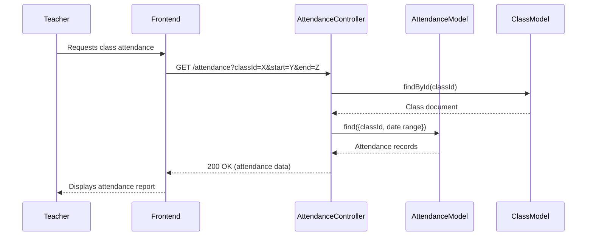
```mermaid
sequenceDiagram
    participant Teacher
    participant UI as Frontend
    participant AttendanceController
    participant AttendanceModel
    participant ClassModel
    
    Teacher->>UI: Requests class attendance
    UI->>AttendanceController: GET /attendance?classId=X&start=Y&end=Z
    AttendanceController->>ClassModel: findById(classId)
    ClassModel-->>AttendanceController: Class document
    AttendanceController->>AttendanceModel: find({classId, date range})
    AttendanceModel-->>AttendanceController: Attendance records
    AttendanceController-->>UI: 200 OK (attendance data)
    UI-->>Teacher: Displays attendance report
```
### Sequence Diagram: Contest Creation Sequence
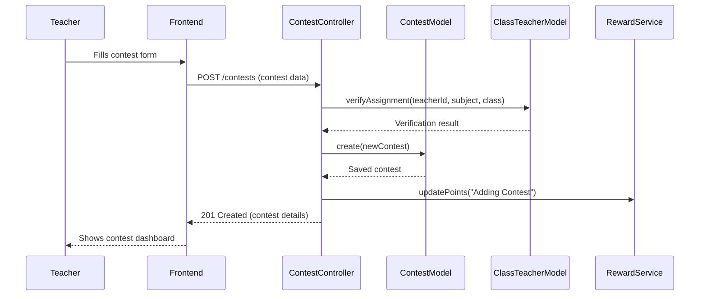
```mermaid
sequenceDiagram
    participant Teacher
    participant UI as Frontend
    participant ContestController
    participant ContestModel
    participant ClassTeacherModel
    
    Teacher->>UI: Fills contest form
    UI->>ContestController: POST /contests (contest data)
    ContestController->>ClassTeacherModel: verifyAssignment(teacherId, subject, class)
    ClassTeacherModel-->>ContestController: Verification result
    ContestController->>ContestModel: create(newContest)
    ContestModel-->>ContestController: Saved contest
    ContestController->>RewardService: updatePoints("Adding Contest")
    ContestController-->>UI: 201 Created (contest details)
    UI-->>Teacher: Shows contest dashboard
```
### Sequence Diagram: Profile Update Sequence
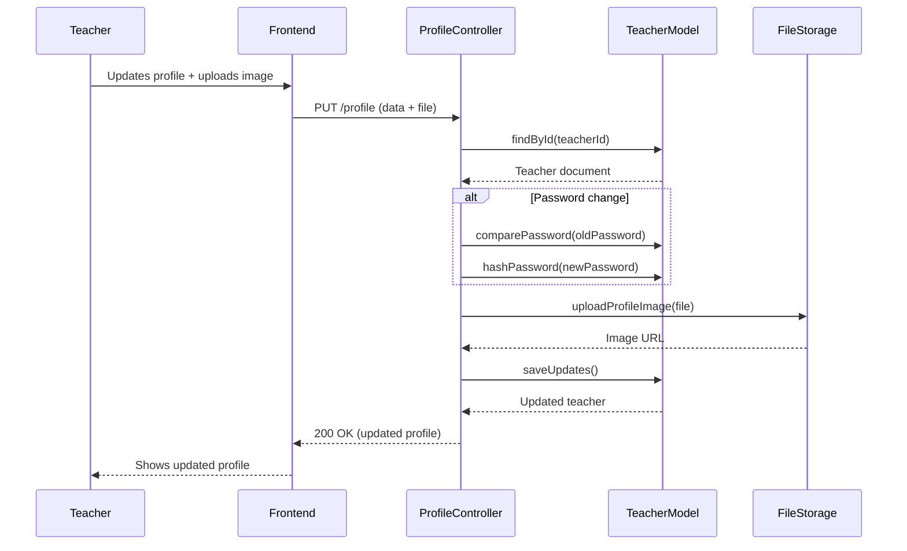
```mermaid
sequenceDiagram
    participant Teacher
    participant UI as Frontend
    participant ProfileController
    participant TeacherModel
    participant FileStorage
    
    Teacher->>UI: Updates profile + uploads image
    UI->>ProfileController: PUT /profile (data + file)
    ProfileController->>TeacherModel: findById(teacherId)
    TeacherModel-->>ProfileController: Teacher document
    alt Password change
        ProfileController->>TeacherModel: comparePassword(oldPassword)
        ProfileController->>TeacherModel: hashPassword(newPassword)
    end
    ProfileController->>FileStorage: uploadProfileImage(file)
    FileStorage-->>ProfileController: Image URL
    ProfileController->>TeacherModel: saveUpdates()
    TeacherModel-->>ProfileController: Updated teacher
    ProfileController-->>UI: 200 OK (updated profile)
    UI-->>Teacher: Shows updated profile
```
### Entity-Relationship Diagram (ERD)
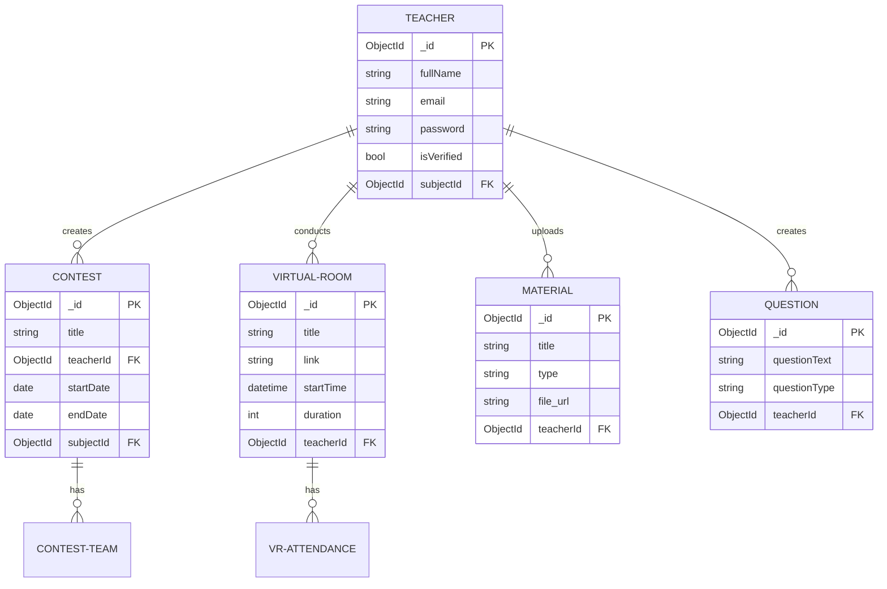
```mermaid
erDiagram
    TEACHER {
        ObjectId _id PK
        string fullName
        string email
        string password
        bool isVerified
        ObjectId subjectId FK
    }
    
    CONTEST {
        ObjectId _id PK
        string title
        ObjectId teacherId FK
        date startDate
        date endDate
        ObjectId subjectId FK
    }
    
    VIRTUAL-ROOM {
        ObjectId _id PK
        string title
        string link
        datetime startTime
        int duration
        ObjectId teacherId FK
    }
    
    MATERIAL {
        ObjectId _id PK
        string title
        string type
        string file_url
        ObjectId teacherId FK
    }
    
    QUESTION {
        ObjectId _id PK
        string questionText
        string questionType
        ObjectId teacherId FK
    }
    
    TEACHER ||--o{ CONTEST : creates
    TEACHER ||--o{ VIRTUAL-ROOM : conducts
    TEACHER ||--o{ MATERIAL : uploads
    TEACHER ||--o{ QUESTION : creates
    CONTEST ||--o{ CONTEST-TEAM : has
    VIRTUAL-ROOM ||--o{ VR-ATTENDANCE : has
```

## Parent Diagrams

## Class Diagram
```mermaid
classDiagram
    class Parent {
        +ObjectId _id
        +String fullName
        +String email
        +String password
        +String phone
        +String profileImage
        +Boolean isVerified
        +login()
        +updateProfile()
        +getData()
    }

    class Student {
        +ObjectId _id
        +String fullName
        +String academic_number
        +ObjectId gradeId
        +ObjectId classId
        +ObjectId academicYear_id
        +getAttendance()
        +getRewards()
        +getGrades()
        +getSchedule()
    }

    class ParentStudent {
        +ObjectId parent_id
        +ObjectId student_id
        +showKids()
        +chooseKid()
    }

    class RewardSystem {
        +getSemesterPoints()
        +getDailyPoints()
        +getAllPoints()
        +getStudentWithFriendsPoints()
    }

    class Dashboard {
        +getDashboardData()
        +calculateMetrics()
        +getAcademicStanding()
    }

    Parent "1" -- "*" ParentStudent : manages
    ParentStudent "*" -- "1" Student : links
    Student "1" -- "*" RewardSystem : has
    Student "1" -- "1" Dashboard : accesses
```
### Sequence Diagram: Login Sequence Diagram
```mermaid
sequenceDiagram
    participant Parent
    participant AuthController
    participant ParentModel
    participant TokenService

    Parent->>AuthController: POST /login (email, password)
    AuthController->>ParentModel: findOne({email})
    ParentModel-->>AuthController: parent data
    AuthController->>ParentModel: comparePassword()
    ParentModel-->>AuthController: true/false
    alt Valid credentials
        AuthController->>TokenService: signToken(parent._id)
        TokenService-->>AuthController: JWT token
        AuthController-->>Parent: 200 OK (token, parent data)
    else Invalid credentials
        AuthController-->>Parent: 401 Unauthorized
    end
```
### Sequence Diagram: Choose Kid Sequence
```mermaid
sequenceDiagram
    participant Parent as Parent
    participant ParentController
    participant ParentStudentModel
    participant TokenService

    Parent->>ParentController: POST /choose-kid {studentId}
    ParentController->>ParentStudentModel: findOne({parent_id, student_id})
    ParentStudentModel-->>ParentController: Relationship record
    alt Relationship not found
        ParentController-->>Parent: 400 Unauthorized
    else Valid relationship
        ParentController->>TokenService: signToken(studentId, role)
        TokenService-->>ParentController: Student token
        ParentController-->>Parent: 200 {student_token}
    end
```
### Sequence Diagram: View Child Attendance Sequence
```mermaid
sequenceDiagram
    participant Parent as Parent
    participant AttendanceController
    participant AttendanceService
    participant AttendanceModel

    Parent->>AttendanceController: GET /child/:studentId/attendance
    AttendanceController->>AttendanceService: getAttendance(studentId)
    AttendanceService->>AttendanceModel: find({studentId})
    AttendanceModel-->>AttendanceService: Attendance records
    AttendanceService-->>AttendanceController: Formatted attendance
    AttendanceController-->>Parent: 200 (Attendance data)
```
### Sequence Diagram: View Child Schedule Sequence
```mermaid
sequenceDiagram
    participant Parent as Parent
    participant ScheduleController
    participant StudentModel
    participant AcademicYearModel
    participant SemesterModel
    participant ScheduleModel

    Parent->>ScheduleController: GET /child/:studentId/schedule
    ScheduleController->>StudentModel: findById(studentId)
    StudentModel-->>ScheduleController: Student record
    ScheduleController->>AcademicYearModel: findCurrentYear()
    AcademicYearModel-->>ScheduleController: Academic year
    ScheduleController->>SemesterModel: findCurrentSemester()
    SemesterModel-->>ScheduleController: Semester
    ScheduleController->>ScheduleModel: find({class, grade, semester})
    ScheduleModel-->>ScheduleController: Schedule data
    ScheduleController-->>Parent: 200 (Class schedule)
```
### Sequence Diagram: View Child Grades Sequence
```mermaid
sequenceDiagram
    participant Parent as Parent
    participant GradeController
    participant GradeService
    participant GradeModel

    Parent->>GradeController: GET /child/:studentId/grades
    GradeController->>GradeService: getStudentGradesReport(studentId)
    GradeService->>GradeModel: find({student_id})
    GradeModel-->>GradeService: Grade records
    GradeService->>GradeService: calculateMetrics()
    GradeService-->>GradeController: Grade report
    GradeController-->>Parent: 200 (Grades report)
```
### Sequence Diagram: View Child Dashboard Sequence
```mermaid
sequenceDiagram
    participant Parent as Parent
    participant DashboardController
    participant DashboardService
    participant MultipleServices

    Parent->>DashboardController: GET /child/:studentId/dashboard
    DashboardController->>DashboardService: getDashboardData(studentId)
    DashboardService->>AttendanceService: getAbsences()
    DashboardService->>ExamService: getCompletedExams()
    DashboardService->>AssignmentService: getMissedAssignments()
    DashboardService->>GradeService: getGradesReport()
    DashboardService->>MaterialService: getMaterials()
    DashboardService->>VirtualRoomService: getVirtualRooms()
    DashboardService->>DashboardService: calculateMetrics()
    DashboardService-->>DashboardController: Dashboard data
    DashboardController-->>Parent: 200 (Dashboard metrics)
```
### Sequence Diagram: Update Profile Sequence
```mermaid
sequenceDiagram
    participant Parent as Parent
    participant ProfileController
    participant ParentModel
    participant FileSystem

    Parent->>ProfileController: PUT /profile {data, file}
    ProfileController->>ParentModel: findById(parentId)
    ParentModel-->>ProfileController: Parent record
    alt New password provided
        ProfileController->>ParentModel: comparePassword(currentPassword)
        ParentModel-->>ProfileController: true/false
        alt Password mismatch
            ProfileController-->>Parent: 401 (Invalid password)
        else Password match
            ProfileController->>bcrypt: hash(newPassword)
        end
    end
    alt Profile image provided
        ProfileController->>FileSystem: delete old image
        ProfileController->>FileSystem: save new image
    end
    ProfileController->>ParentModel: findByIdAndUpdate()
    ParentModel-->>ProfileController: Updated parent
    ProfileController-->>Parent: 200 (Updated profile)
```
### Entity-Relationship Diagram (ERD)
```mermaid
erDiagram
    PARENT ||--o{ PARENT_STUDENT : has
    STUDENT ||--o{ PARENT_STUDENT : belongs_to
    STUDENT ||--o{ ATTENDANCE : has
    STUDENT ||--o{ REWARD_CLAIM : earns
    STUDENT ||--o{ USER_POINT : accumulates
    STUDENT ||--o{ STUDENT_GRADE : has
    STUDENT ||--o{ VIRTUAL_ROOM : participates_in
    REWARD_CLAIM }|--|| REWARD_CATALOG : references
    GRADE_SUBJECT ||--o{ GRADE_SUBJECT_SEMESTER : includes
    SEMESTER ||--o{ GRADE_SUBJECT_SEMESTER : in
    SUBJECT ||--o{ GRADE_SUBJECT : categorized_under
    GRADE ||--o{ GRADE_SUBJECT : has
    ACADEMIC_YEAR ||--o{ SEMESTER : contains

    PARENT {
        ObjectId _id PK
        String fullName
        String email
        String password
        String phone
        String profileImage
        Boolean isVerified
    }
    
    STUDENT {
        ObjectId _id PK
        String fullName
        String academic_number
        ObjectId gradeId FK
        ObjectId classId FK
        ObjectId academicYear_id FK
    }
    
    REWARD_CLAIM {
        ObjectId _id PK
        ObjectId userId FK
        String userType
        ObjectId rewardId FK
        String rewardType
        Number value
        Date claimDate
    }
    
    STUDENT_GRADE {
        ObjectId _id PK
        ObjectId student_id FK
        ObjectId subject_id FK
        ObjectId semester_id FK
        Number midterm_examGrade
        Number midterm_finalDegree
        Number final_examGrade
        Number final_finalDegree
    }
```
### Flowchart
```mermaid
flowchart TD
    A[Start] --> B[Parent Login]
    B --> C{Login Successful?}
    C -->|No| D[Show Error]
    C -->|Yes| E[Parent Dashboard]
    
    E --> F[Profile Management]
    F --> F1[Update Password]
    F --> F2[Update Phone]
    F --> F3[Update Profile Image]
    
    E --> G[Child Management]
    G --> G1[View Children List]
    G1 --> G11[Choose Child]
    
    G11 --> H[Child Dashboard]
    H --> H1[View Rewards]
    H1 --> H11[Daily Points]
    H1 --> H12[Semester Points]
    H1 --> H13[All Points]
    H1 --> H14[Leaderboard]
    
    H --> H2[View Attendance]
    H2 --> H21[Absence Days]
    H2 --> H22[Attendance Rate]
    
    H --> H3[View Grades]
    H3 --> H31[Subject Grades]
    H3 --> H32[Semester Grades]
    H3 --> H33[Full Report]
    H3 --> H34[Academic Standing]
    
    H --> H4[View Schedule]
    H4 --> H41[Daily Classes]
    H4 --> H42[Subject Teachers]
    
    H --> H5[View Virtual Rooms]
    H5 --> H51[Completed Rooms]
    H5 --> H52[Missed Rooms]
    H5 --> H53[Upcoming Rooms]
    
    H --> H6[View Contests]
    H6 --> H61[Subject Contests]
    H6 --> H62[Results]
    
    H --> H7[View Materials]
    H7 --> H71[Subject Resources]
    H7 --> H72[Downloads]
    
    E --> I[System Features]
    I --> I1[Switch Child]
    I --> I2[Logout]
    
    D --> K[End]
    I2 --> K
```

## Manager Diagrams

### Class Diagram
```mermaid
classDiagram
    class AuthManagerController {
        +login()
        +updateManagerProfile()
    }
    
    class AbsenceController {
        +FetchClasses()
        +FetchAbsenceForClassInDay()
    }
    
    class DashBoardController {
        +getStatistics()
        +getGradeStatistics()
        +getDailyAttendancePercentage()
        +getTop10Students()
    }
    
    class GradesController {
        +getExamResults()
        +getUniqueNames()
    }
    
    class ManagerData {
        +getLoggedInManagerData()
    }
    
    class SHController {
        +createSchoolHub()
        +getAllSchoolHubs()
        +updateSchoolHub()
        +deleteSchoolHub()
        +getContestStudents()
    }
    
    class VirtualRoomController {
        +createVirtualRoom()
        +updateVirtualRoom()
        +deleteVirtualRoom()
        +getVirtualRoom()
        +getAllVirtualRooms()
    }
    
    class Manager {
        +email
        +password
        +profileImage
        +phone
        +isVerified
        +comparePasswordInDb()
    }
    
    class VirtualRoom {
        +title
        +academicYearId
        +semesterId
        +startTime
        +duration
        +link
        +managerId
    }
    
    AuthManagerController --> Manager : uses
    VirtualRoomController --> VirtualRoom : manages
    VirtualRoomController --> Manager : uses
    SHController --> Manager : uses
    ManagerData --> Manager : fetches
```
### Sequence Diagram: Manager Login
```mermaid
sequenceDiagram
    participant Client
    participant Controller as AuthManagerController
    participant ManagerModel
    participant Bcrypt
    
    Client->>Controller: POST /login (email, password)
    Controller->>ManagerModel: findOne({email})
    ManagerModel-->>Controller: Manager document
    alt Missing credentials
        Controller-->>Client: 400 Bad Request
    else Invalid credentials
        Controller->>Bcrypt: comparePassword()
        Bcrypt-->>Controller: false
        Controller-->>Client: 401 Unauthorized
    else Unverified account
        Controller-->>Client: 401 Unauthorized (verify email)
    else Valid credentials
        Controller->>Controller: signToken()
        Controller-->>Client: 200 OK (token + manager data)
    end
```
### Sequence Diagram: Dashboard Statistics Sequence
```mermaid
sequenceDiagram
    participant Client
    participant DashboardController
    participant Models
    Client->>DashboardController: GET /statistics
    DashboardController->>Models: countDocuments()
    Models-->>DashboardController: Student/Teacher/Parent counts
    DashboardController->>Models: aggregate(gender)
    DashboardController->>Models: find(top students)
    DashboardController-->>Client: 200 (stats + percentages)
```
### Sequence Diagram: Create Virtual Room Sequence
```mermaid
sequenceDiagram
    participant Client
    participant Controller
    participant AcademicYearModel
    participant VirtualRoomModel
    Client->>Controller: POST /virtual-rooms
    Controller->>AcademicYearModel: findCurrentAcademicYear()
    AcademicYearModel-->>Controller: academicYearId
    Controller->>VirtualRoomModel: create(title, link, etc.)
    VirtualRoomModel-->>Controller: New virtual room
    Controller-->>Client: 201 Created
```
### Sequence Diagram: Update Profile Sequence
```mermaid
sequenceDiagram
    participant Client
    participant Controller
    participant ManagerModel
    participant FS
    Client->>Controller: PATCH /profile (with updates)
    Controller->>ManagerModel: findById(managerId)
    alt No updates provided
        Controller->>FS: unlinkTempFile()
        Controller-->>Client: 400 Validation Error
    else Password change
        Controller->>ManagerModel: comparePassword()
        Controller->>bcrypt: hash(newPassword)
    end
    alt Profile image update
        Controller->>FS: deleteOldImage()
        Controller->>FS: saveNewImage()
    end
    Controller->>ManagerModel: findByIdAndUpdate()
    ManagerModel-->>Controller: Updated manager
    Controller-->>Client: 200 Success
```
### Flowchart
```mermaid
flowchart TD
    A[Manager] --> B[Authentication]
    A --> C[Dashboard]
    A --> D[Absence Tracking]
    A --> E[Grades Management]
    A --> F[Profile Management]
    A --> G[School Hub]
    A --> H[Virtual Rooms]
    
    B --> B1[Login]
    
    C --> C1[View Statistics]
    C --> C2[Grade Performance]
    C --> C3[Daily Attendance]
    C --> C4[Top Students]
    
    D --> D1[Fetch Classes]
    D --> D2[View Daily Absence]
    
    E --> E1[Get Unique Names]
    E --> E2[View Exam Results]
    
    F --> F1[Update Profile]
    F --> F2[Change Password]
    F --> F3[Update Profile Image]
    
    G --> G1[Create Contest]
    G --> G2[View Contests]
    G --> G3[Update Contest]
    G --> G4[Delete Contest]
    G --> G5[View Participants]
    
    H --> H1[Create Virtual Room]
    H --> H2[View Virtual Rooms]
    H --> H3[Update Virtual Room]
    H --> H4[Delete Virtual Room]
```
### Entity-Relationship Diagram (ERD)
```mermaid
erDiagram
    MANAGER ||--o{ VIRTUAL_ROOM : creates
    MANAGER {
        ObjectId _id PK
        string email
        string password
        string fullName
        string phone
        string profileImage
        boolean isVerified
    }
    
    VIRTUAL_ROOM {
        ObjectId _id PK
        string title
        ObjectId academicYearId FK
        ObjectId semesterId FK
        Date startTime
        number duration
        string link
        ObjectId managerId FK
    }
    
    ACADEMIC_YEAR ||--o{ SEMESTER : contains
    ACADEMIC_YEAR {
        ObjectId _id PK
        string startYear
        string endYear
    }
    
    SEMESTER {
        ObjectId _id PK
        string semesterName
        ObjectId academicYear_id FK
    }
    
    GRADE ||--o{ CLASS_GROUP : contains
    GRADE ||--o{ STUDENT : has
    GRADE {
        ObjectId _id PK
        string gradeName
        string level
    }
    
    CLASS_GROUP {
        ObjectId _id PK
        string className
        ObjectId gradeId FK
        ObjectId academicYear_id FK
    }
    
    STUDENT ||--o{ SCORE : achieves
    STUDENT ||--o{ ATTENDANCE : has
    STUDENT ||--o{ PARTICIPATION : participates_in
    STUDENT ||--o{ REWARD_CLAIM : earns
    STUDENT ||--o{ USER_POINT : accumulates
    STUDENT {
        ObjectId _id PK
        string fullName
        string academic_number
        string email
        string phone
        string gender
        ObjectId gradeId FK
        ObjectId classId FK
    }
    
    SUBJECT ||--o{ SUBJECT_SCORE : assessed_in
    SUBJECT {
        ObjectId _id PK
        string subjectName
        string subjectCode
    }
    
    SUBJECT_SCORE ||--o{ SCORE : contributes_to
    SUBJECT_SCORE {
        ObjectId _id PK
        ObjectId subjectId FK
        ObjectId gradeId FK
        ObjectId semesterId FK
        string type
        number finalDegree
    }
    
    SCORE {
        ObjectId _id PK
        ObjectId studentId FK
        ObjectId subjectScoreId FK
        ObjectId classId FK
        ObjectId teacherId FK
        number examGrade
    }
    
    ATTENDANCE {
        ObjectId _id PK
        ObjectId student_id FK
        ObjectId class_id FK
        Date date
        string status
    }
    
    SCHOOL_HUB ||--o{ PARTICIPATION : includes
    SCHOOL_HUB {
        ObjectId _id PK
        string title
        Date registrationStart
        Date registrationEnd
        Date contestDate
        string location
        string details
        string prizes
    }
    
    PARTICIPATION {
        ObjectId _id PK
        ObjectId schoolHubId FK
        ObjectId studentId FK
        boolean participated
    }
    
    REWARD_CLAIM {
        ObjectId _id PK
        ObjectId userId FK
        string userType
        ObjectId rewardId
        string rewardType
        number value
    }
    
    USER_POINT {
        ObjectId _id PK
        ObjectId userId FK
        string userType
        string badges
    }
    
    TEACHER {
        ObjectId _id PK
        string gender
    }
    
    PARENT {
        ObjectId _id PK
    }
    
    ADMIN {
        ObjectId _id PK
    }
    
    SCHEDULE {
        ObjectId _id PK
    }
```
## Student diagrams

### Class diagram
```mermaid
classDiagram
    class Student {
        +String _id
        +String fullName
        +String email
        +String password
        +String academic_number
        +String profileImage
        +ObjectId gradeId
        +ObjectId classId
        +ObjectId academicYear_id
        +Boolean isVerified
        +login()
        +comparePasswordInDb()
        +updateProfile()
    }

    class Material {
        +String _id
        +String title
        +String description
        +String fileUrl
        +ObjectId gradeSubjectSemesterId
        +ObjectId uploaded_by
    }

    class Contest {
        +String _id
        +String title
        +String description
        +ObjectId subjectId
        +Number numberOfTeamMembers
    }

    class ContestTeam {
        +String _id
        +String teamName
        +ObjectId contestId
        +ObjectId[] teamMembers
        +ObjectId leaderId
    }

    class Question {
        +String _id
        +String questionText
        +String[] options
        +String correctAnswer
        +ObjectId gradeSubjectSemesterId
    }

    class RewardSystem {
        +RewardClaim[]
        +UserPoint userPoint
        +addRewardClaim()
        +updatePoints()
        +calculateBadges()
    }

    class RewardClaim {
        +String _id
        +ObjectId userId
        +String userType
        +ObjectId rewardId
        +Date claimDate
        +String rewardType
        +Number value
    }

    class UserPoint {
        +String _id
        +ObjectId userId
        +String userType
        +Number totalPoints
        +String badges
    }

    class Attendance {
        +String _id
        +ObjectId student_id
        +Date date
        +String status
    }

    class Schedule {
        +String _id
        +String day
        +Time startTime
        +Time endTime
        +ObjectId subject_id
        +ObjectId class_id
        +ObjectId grade_id
    }

    class GradeSubject {
        +String _id
        +ObjectId gradeId
        +ObjectId subjectId
    }

    class Bookmark {
        +Material[]
        +Question[]
        +addMaterialBookmark()
        +addQuestionBookmark()
        +getAllBookmarks()
    }

    class ViewTracking {
        +MaterialView[]
        +LibraryMaterialView[]
        +QuestionView[]
        +updateViewStatus()
        +getViewHistory()
    }

    class PerformanceTracking {
        +Number[] subjectAverages
        +Number absentDays
        +predictPerformance()
    }

    class SchoolHub {
        +String _id
        +String title
        +String description
        +Date date
    }

    class Trip {
        +String _id
        +String title
        +String description
        +Date date
        +ObjectId teacherId
    }

    Student "1" -- "0..*" Attendance: has
    Student "1" -- "0..*" ContestTeam: member_of
    Student "1" -- "1" UserPoint: has_points
    Student "1" -- "0..*" RewardClaim: earns
    Student "1" -- "1" PerformanceTracking: has_performance
    Student "1" -- "1" Bookmark: has_bookmarks
    Student "1" -- "1" ViewTracking: has_view_history
    
    Contest "1" -- "0..*" ContestTeam: has_teams
    ContestTeam "1" -- "1..*" Student: consists_of
    
    Material "1" -- "0..*" Bookmark: bookmarked_by
    Question "1" -- "0..*" Bookmark: bookmarked_by
    Material "1" -- "0..*" ViewTracking: viewed_by
    Question "1" -- "0..*" ViewTracking: viewed_by
    
    RewardSystem "1" -- "0..*" RewardClaim: manages
    RewardSystem "1" -- "1" UserPoint: manages
    
    GradeSubject "1" -- "0..*" Material: contains
    GradeSubject "1" -- "0..*" Question: contains
    
    Schedule "1" -- "1" Student: for_class
    SchoolHub "1" -- "0..*" Student: participated_by
    Trip "1" -- "0..*" Student: attended_by
```
### Sequence diagram: Student Login Sequence
```mermaid
sequenceDiagram
    participant Student
    participant AuthController
    participant StudentModel
    participant TokenService
    
    Student->>AuthController: POST /login (email, password)
    AuthController->>StudentModel: findOne({email}).select("+password")
    StudentModel-->>AuthController: Student data
    alt Invalid credentials
        AuthController-->>Student: 401 Unauthorized
    else Valid credentials
        AuthController->>StudentModel: comparePasswordInDb()
        StudentModel-->>AuthController: true/false
        AuthController->>TokenService: signToken()
        TokenService-->>AuthController: JWT
        AuthController-->>Student: 200 Success (token + student data)
    end
```
### Sequence diagram: Create Contest Team Sequence
```mermaid
sequenceDiagram
    participant Student
    participant ContestTeamController
    participant ContestModel
    participant StudentModel
    participant ContestTeamModel
    participant RewardsService
    
    Student->>ContestTeamController: POST /contests/:id/teams
    ContestTeamController->>ContestModel: findById(contestId)
    ContestTeamController->>StudentModel: findOne({fullName, academic_number})
    loop For each teammate
        ContestTeamController->>ContestTeamModel: Check existing participation
    end
    ContestTeamController->>ContestTeamModel: create(newTeam)
    ContestTeamController->>RewardsService: addRewardClaim(teamMembers)
    ContestTeamModel-->>ContestTeamController: Created team
    ContestTeamController-->>Student: 201 Created
```
### Sequence diagram: View Material Sequence
```mermaid
sequenceDiagram
    participant Student
    participant MaterialViewController
    participant MaterialViewModel
    participant RewardsService
    
    Student->>MaterialViewController: GET /materials/view/:id
    MaterialViewController->>MaterialViewModel: findOneAndUpdate()
    alt First view
        MaterialViewController->>RewardsService: addRewardClaim()
        RewardsService->>RewardsService: Update points
    end
    MaterialViewModel-->>MaterialViewController: Updated view record
    MaterialViewController-->>Student: 200 Success
```
### Sequence diagram: Get Grades Sequence
```mermaid
sequenceDiagram
    participant Student
    participant GradeController
    participant AcademicYearService
    participant SemesterService
    participant SubjectScoreModel
    participant ScoreModel
    
    Student->>GradeController: GET /grades/:subjectId
    GradeController->>AcademicYearService: getCurrentAcademicYear()
    GradeController->>SemesterService: getCurrentSemester()
    GradeController->>SubjectScoreModel: find({subjectId, semesterId})
    loop For each subject score
        GradeController->>ScoreModel: find({studentId, subjectScoreId})
    end
    ScoreModel-->>GradeController: Grades data
    GradeController-->>Student: 200 Success (midterm/final grades)
```
### Sequence diagram: Update Profile Sequence
```mermaid
sequenceDiagram
    participant Student
    participant ProfileController
    participant StudentModel
    participant bcrypt
    participant FileSystem
    
    Student->>ProfileController: PATCH /profile (with image/data)
    ProfileController->>StudentModel: findById(studentId)
    alt Password change
        ProfileController->>StudentModel: comparePasswordInDb()
        ProfileController->>bcrypt: hash(newPassword)
    end
    alt Profile image update
        ProfileController->>FileSystem: delete old image
    end
    ProfileController->>StudentModel: findByIdAndUpdate()
    StudentModel-->>ProfileController: Updated student
    ProfileController-->>Student: 200 Success
```
### Sequence diagram: Register in School Hub Sequence
```mermaid
sequenceDiagram
    participant Student
    participant SchoolHubController
    participant ParticipationModel
    participant RewardsService
    
    Student->>SchoolHubController: POST /schoolhub/:id/register
    SchoolHubController->>ParticipationModel: findOne({studentId, schoolHubId})
    alt New participation
        SchoolHubController->>ParticipationModel: create()
        SchoolHubController->>RewardsService: addRewardClaim()
        RewardsService->>RewardsService: Update points
        ParticipationModel-->>SchoolHubController: New record
        SchoolHubController-->>Student: 201 Created
    else Already registered
        SchoolHubController-->>Student: 400 Already registered
    end
```
### Flowchart
```mermaid
graph TD
    A[Student] --> B[Authentication]
    A --> C[Academic Activities]
    A --> D[Rewards System]
    A --> E[Social & Extracurricular]
    A --> F[Personal Management]
    
    B --> B1[Login]
    B --> B2[Update Profile]
    B2 --> B2a[Change Password]
    B2 --> B2b[Update Profile Image]
    B2 --> B2c[Update Phone Number]
    
    C --> C1[View Materials]
    C1 --> C1a[Track Views]
    C1 --> C1b[Bookmark Materials]
    C --> C2[Question Bank]
    C2 --> C2a[View Questions]
    C2 --> C2b[Bookmark Questions]
    C --> C3[Grades]
    C3 --> C3a[Subject Grades]
    C3 --> C3b[Semester Grades]
    C3 --> C3c[All Grades]
    C --> C4[Performance]
    C4 --> C4a[View Predictions]
    C --> C5[Schedule]
    C5 --> C5a[View Class Schedule]
    
    D --> D1[Points Tracking]
    D1 --> D1a[Daily Points]
    D1 --> D1b[Semester Points]
    D1 --> D1c[Total Points]
    D --> D2[Badges]
    D2 --> D2a[View Badges]
    D2 --> D2b[Leaderboard]
    D2 --> D2c[Compare with Friends]
    
    E --> E1[Contests]
    E1 --> E1a[Create Team]
    E1 --> E1b[Edit Team]
    E1 --> E1c[Delete Team]
    E1 --> E1d[View Teams]
    E --> E2[School Hub]
    E2 --> E2a[Register]
    E2 --> E2b[Check Participation]
    E2 --> E2c[Delete Registration]
    E --> E3[Trips]
    E3 --> E3a[View All Trips]
    
    F --> F1[Attendance]
    F1 --> F1a[View Attendance]
    F1 --> F1b[View Absences]
    F --> F2[Bookmarks]
    F2 --> F2a[View Material Bookmarks]
    F2 --> F2b[View Question Bookmarks]
    F2 --> F2c[Delete Bookmarks]
```
### Entity-Relationship Diagram (ERD)
```mermaid
erDiagram
    STUDENT {
        string student_id
        string full_name
        string email
        string password
        string academic_number
        string profile_image_url
        date date_joined
        bool is_verified
        string classroom_id
        string grade_id
        string academic_year_id
    }
    
    CLASSROOM {
        string classroom_id
        string name
    }
    
    ATTENDANCE {
        string attendance_id
        date attendance_date
        string status
        string student_id
    }
    
    MATERIAL {
        string material_id
        string title
        string description
        string file_url
        datetime upload_date
        string grade_subject_id
    }
    
    MATERIAL_VIEW {
        string view_id
        datetime view_date
        string student_id
        string material_id
    }
    
    QUESTION {
        string question_id
        text question_text
        json options
        string correct_answer
        string difficulty
        string grade_subject_id
    }
    
    QUESTION_VIEW {
        string view_id
        datetime view_date
        string student_id
        string question_id
    }
    
    BOOKMARK {
        string bookmark_id
        string type
        datetime created_at
        string student_id
        string material_id
        string question_id
    }
    
    REWARD_CATALOG {
        string reward_id
        string name
        string description
        int points_value
    }
    
    REWARD_CLAIM {
        string claim_id
        datetime claim_date
        string type
        string student_id
        string reward_id
    }
    
    USER_POINT {
        string point_id
        int total_points
        string badge_level
        string student_id
    }
    
    CONTEST {
        string contest_id
        string title
        text description
        date start_date
        date end_date
        int max_team_size
        string subject_id
    }
    
    CONTEST_TEAM {
        string team_id
        string team_name
        string contest_id
        string leader_id
    }
    
    CONTEST_TEAM_MEMBER {
        string team_id
        string student_id
    }
    
    SCORE {
        string score_id
        int exam_grade
        int final_degree
        string exam_type
        string student_id
        string subject_id
    }
    
    SCHOOL_HUB {
        string hub_id
        string title
        text description
        date event_date
    }
    
    PARTICIPATION {
        string participation_id
        bool participated
        datetime registration_date
        string student_id
        string hub_id
    }
    
    TRIP {
        string trip_id
        string title
        text description
        date trip_date
        string location
    }
    
    SCHEDULE {
        string schedule_id
        string day_of_week
        time start_time
        time end_time
        string classroom_id
        string subject_id
        string semester_id
    }
    
    GRADE_SUBJECT {
        string grade_subject_id
        string grade_id
        string subject_id
    }
    
    SUBJECT {
        string subject_id
        string name
    }
    
    GRADE {
        string grade_id
        string name
    }
    
    ACADEMIC_YEAR {
        string year_id
        int start_year
        int end_year
    }
    
    SEMESTER {
        string semester_id
        string name
        string academic_year_id
    }

    STUDENT ||--o{ ATTENDANCE : "has"
    STUDENT ||--o{ MATERIAL_VIEW : "views"
    STUDENT ||--o{ QUESTION_VIEW : "views"
    STUDENT ||--o{ BOOKMARK : "creates"
    STUDENT ||--o{ REWARD_CLAIM : "earns"
    STUDENT ||--o{ CONTEST_TEAM_MEMBER : "member_of"
    STUDENT ||--o{ PARTICIPATION : "participates_in"
    STUDENT ||--o{ SCORE : "has"
    STUDENT }o--|| CLASSROOM : "belongs_to"
    STUDENT }o--|| GRADE : "belongs_to"
    
    CLASSROOM ||--o{ SCHEDULE : "has"
    GRADE ||--o{ GRADE_SUBJECT : "contains"
    GRADE_SUBJECT ||--|| SUBJECT : "includes"
    GRADE_SUBJECT ||--o{ MATERIAL : "has"
    GRADE_SUBJECT ||--o{ QUESTION : "has"
    
    SUBJECT ||--o{ CONTEST : "has"
    CONTEST ||--o{ CONTEST_TEAM : "contains"
    
    REWARD_CATALOG ||--o{ REWARD_CLAIM : "claimed_as"
    USER_POINT ||--|| STUDENT : "for"
    
    SCHEDULE ||--|| SUBJECT : "for"
    SCHEDULE ||--|| SEMESTER : "in"
    SEMESTER ||--|| ACADEMIC_YEAR : "part_of"
    
    TRIP ||--o{ STUDENT : "attended_by"
    SCHOOL_HUB ||--o{ PARTICIPATION : "has"
    CONTEST_TEAM ||--o{ CONTEST_TEAM_MEMBER : "has"
```
