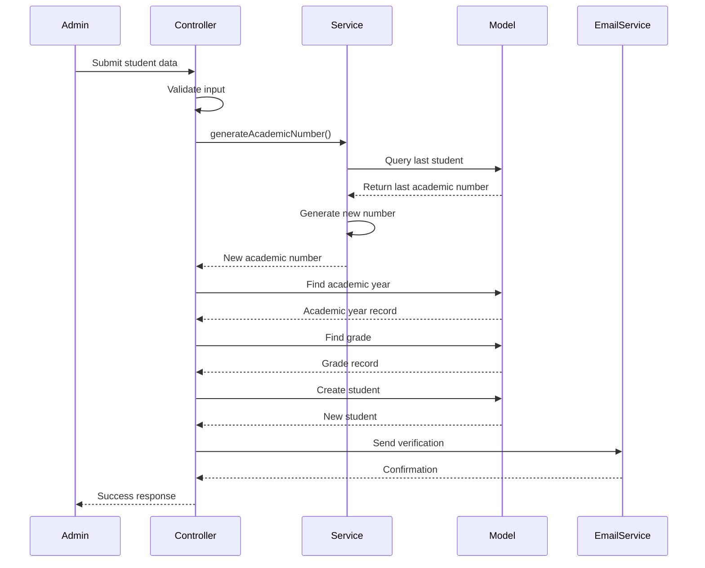
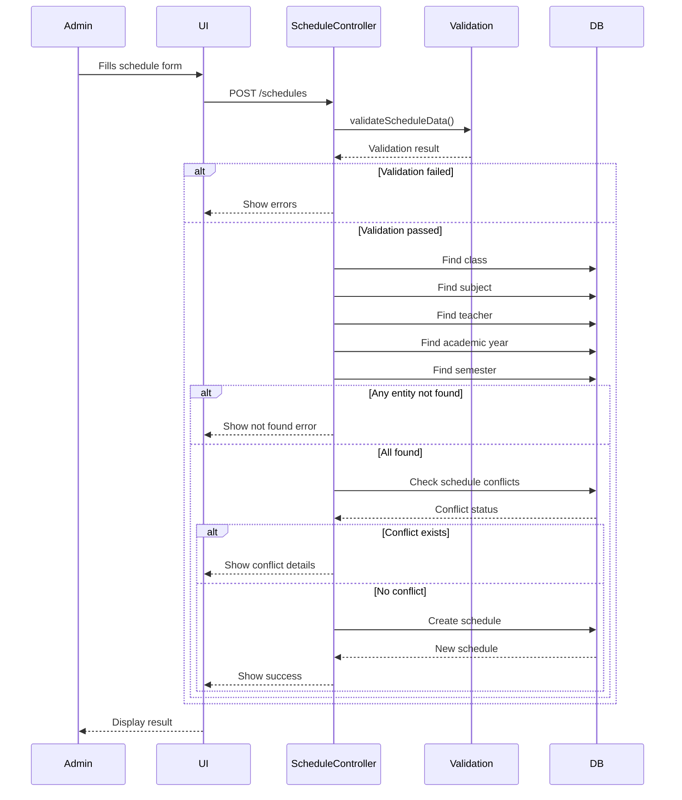
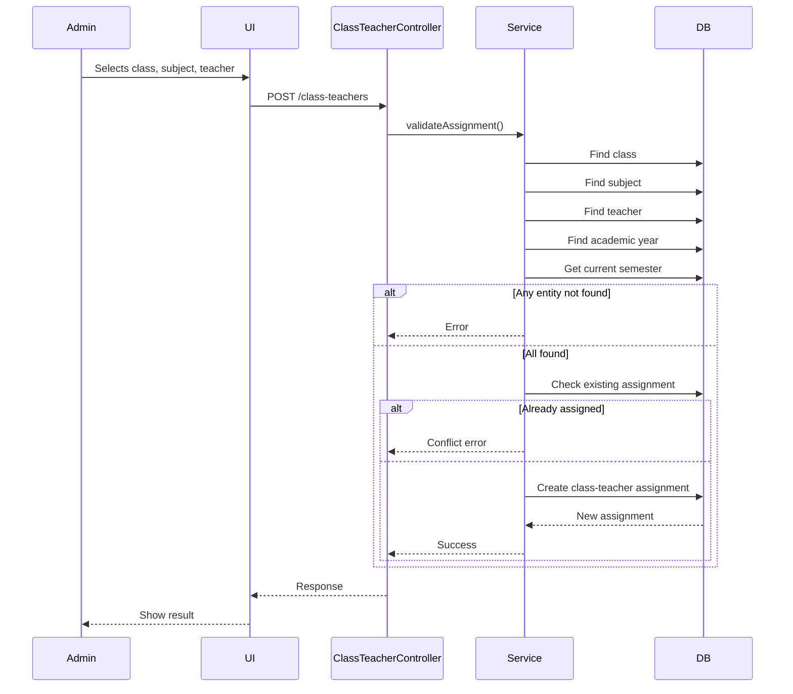
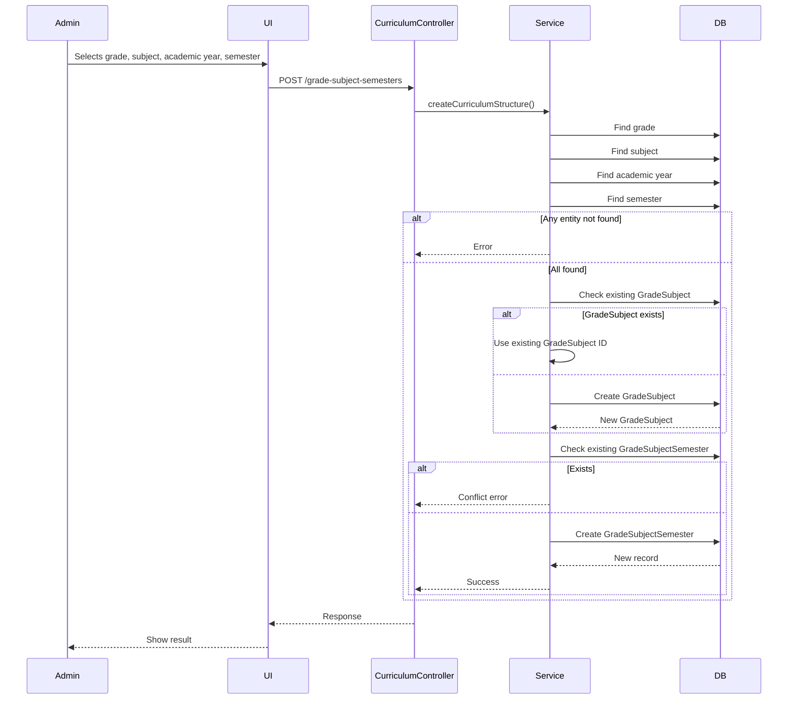
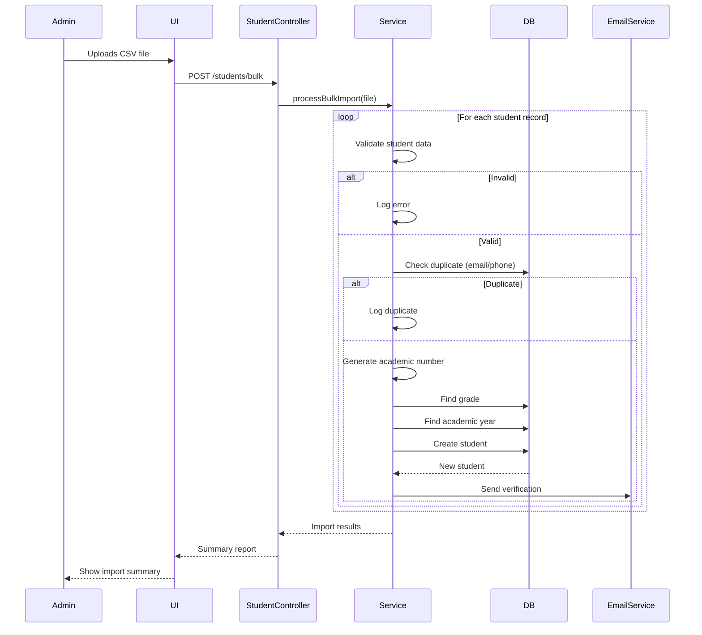
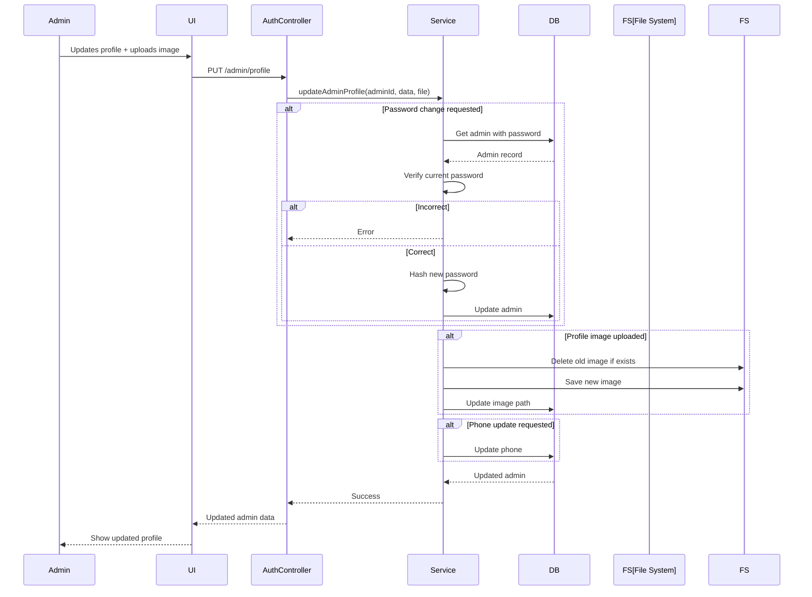
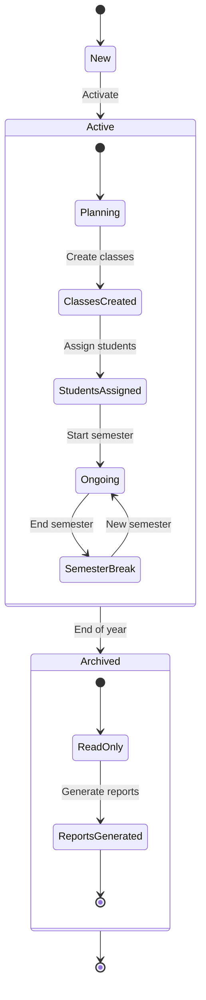

# Learnova

## Admin Diagrams

### Flowchart

```mermaid
flowchart TD
    A[Admin Login] --> B[Dashboard]
    B --> C[Academic Management]
    B --> D[User Management]
    B --> E[Curriculum Management]
    B --> F[Scheduling]
    B --> G[System Configuration]
    
    C --> C1[Create Academic Year]
    C --> C2[Add Semesters]
    C --> C3[Manage Grades]
    C --> C4[Create Classes]
    
    D --> D1[Add Teachers]
    D --> D2[Add Students]
    D --> D3[Add Parents]
    D --> D4[Add Admins]
    D --> D5[Bulk Student Import]
    D --> D6[Assign Students to Classes]
    
    E --> E1[Create Subjects]
    E --> E2[Assign Subjects to Grades]
    E --> E3[Manage Curriculum Structure]
    
    F --> F1[Create Class Schedules]
    F --> F2[Assign Teachers to Classes]
    F --> F3[Manage Timetables]
    F --> F4[Check Schedule Conflicts]
    
    G --> G1[Update Profile]
    G --> G2[Configure System Settings]
    G --> G3[Backup & Restore]
    G --> G4[Manage Academic Calendar]
```

### Sequence Diagram: Student Creation

### Sequence Diagram: Admin Creating a Class Schedule

### Sequence Diagram: Admin Assigning Teacher to Class

### Sequence Diagram: Admin Creating Curriculum Structure (Grade-Subject-Semester)

### Sequence Diagram: Admin Bulk Student Import

### Sequence Diagram: Class Schedule Creation Sequence

### Sequence Diagram: Admin Profile Update

### Entity State Diagram: Academic Year Lifecycle

### Class Diagram: Core Admin Functionality

### Academic Year Lifecycle State Diagram

